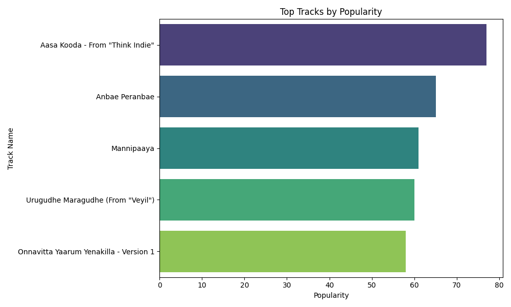
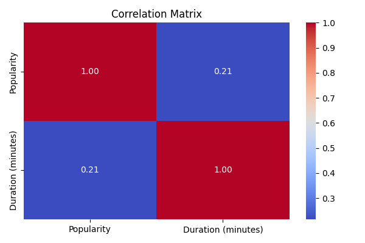

# 🎵 Spotify Track Metadata Analysis

This project extracts and analyzes metadata from multiple Spotify tracks using the Spotify Web API. The tracks are visualized and stored in a MySQL database, and then exported to CSV for further analysis.

## 📌 Objectives

- Extract track metadata using Spotipy.
- Store metadata in MySQL.
- Export and clean data for EDA.
- Visualize track popularity and duration.
- Identify patterns and relationships.

---

## ⚙️ Tech Stack

- Python
- Pandas, Matplotlib, Seaborn
- MySQL
- Spotipy (Spotify Web API Wrapper)

---

## 📥 Data Collection

- Track URLs are read from a `.txt` file.
- Spotipy is used to fetch:
  - Track Name
  - Artist
  - Album
  - Popularity
  - Duration (in minutes)

Data is stored in a MySQL table and exported to `Full_Track.csv`.

---

## 📊 Exploratory Data Analysis (EDA)

### 🔹 Top Tracks by Popularity

### 🔹 Correlation Matrix

---

## 📁 Dataset

You can download or view the dataset used in this analysis here:  
🔗 [Full_Track.csv](Full_Track.csv)

| Track Name | Artist | Album | Popularity | Duration (minutes) |
|------------|--------|-------|------------|---------------------|
| ...        | ...    | ...   | ...        | ...                 |

